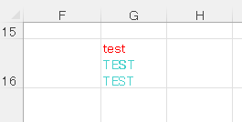

# umya-spreadsheet


[](https://crates.io/crates/umya-spreadsheet)

[](https://github.com/MathNya/umya-spreadsheet#license)
[](https://gitter.im/MathNya/umya-spreadsheet?utm_source=badge&utm_medium=badge&utm_campaign=pr-badge&utm_content=badge)
[](https://github.com/sponsors/MathNya)

## Description
**umya-spreadsheet** is a library written in pure Rust and read and write xlsx file.

## Chatting
Please use [Gitter](https://gitter.im/MathNya/umya-spreadsheet) for brief chats.

## New features
### ver 1.1.0
#### **Table support made available.** (Thank you, [vonkruel](https://github.com/vonkruel).)
#### **Sheet Protection support made available.**
```rust
sheet
    .get_sheet_protection_mut()
    .set_password("password")
    .set_sheet(true);
```

#### **Workbook Protection support made available.**
```rust
book.get_workbook_protection_mut()
    .set_workbook_password("password");
```

#### **HTML to Richtext support made available.**
```rust
let html = r##"<font color="red">test</font><br><font class="test" color="#48D1CC">TE<b>S</b>T<br/>TEST</font>"##;
let richtext = umya_spreadsheet::helper::html::html_to_richtext(html).unwrap();
sheet.get_cell_mut("G16").set_rich_text(richtext);
// Enable line breaks.
sheet.get_cell_mut("G16").get_style_mut().get_alignment_mut().set_wrap_text(true);
```


## Usage
### Installation
Add the following code to Cargo.toml
```toml
[dependencies]
umya-spreadsheet = "1.1.0"
```
Add the following code to main.rs
```rust
extern crate umya_spreadsheet;
```
### Read file
```rust
let path = std::path::Path::new("./tests/test_files/aaa.xlsx");
let mut book = umya_spreadsheet::reader::xlsx::read(path).unwrap();
```
### Read file (Lazy)
Delays the loading of the worksheet until it is needed.  
When loading a file with a large amount of data, response improvement can be expected.
```rust
let path = std::path::Path::new("./tests/test_files/aaa.xlsx");
let mut book = umya_spreadsheet::reader::xlsx::lazy_read(path).unwrap();
```
### New file
```rust
let mut book = umya_spreadsheet::new_file();
```
### Write file
```rust
let path = std::path::Path::new("./tests/result_files/bbb.xlsx");
let _ = umya_spreadsheet::writer::xlsx::write(&book, path);
```
### Write file with password
```rust
let path = std::path::Path::new("./tests/result_files/bbb.xlsx");
let _ = umya_spreadsheet::writer::xlsx::write_with_password(&book, path, "password");
```
```rust
let from_path = std::path::Path::new("./tests/test_files/aaa.xlsx");
let to_path = std::path::Path::new("./tests/result_files/bbb.xlsx");
let _ = umya_spreadsheet::writer::xlsx::set_password(&from_path, &to_path, "password");
```
### Read Value
```rust
let mut book = umya_spreadsheet::new_file();
book.get_sheet_by_name("Sheet1").unwrap().get_cell("A1").get_value();
book.get_sheet_by_name("Sheet1").unwrap().get_cell((1, 1)).get_value();
book.get_sheet_by_name("Sheet1").unwrap().get_cell((&1, &1)).get_value();
book.get_sheet_mut(0).unwrap().get_cell((&1, &1)).get_value();
```
### Change Value
```rust
let mut book = umya_spreadsheet::new_file();
book.get_sheet_by_name_mut("Sheet1").unwrap().get_cell_mut("A1").set_value("TEST1");
book.get_sheet_mut(0).unwrap().get_cell_mut("A1").set_value("TEST2");
```
### Move Values
```rust
let range = "A1:A3";
let row = 10;
let column = 2;
book.get_sheet_by_name_mut("Sheet1").unwrap().move_range(range, &row, &column);
```
### Change Style
```rust
let mut book = umya_spreadsheet::new_file();
let mut style = book.get_sheet_by_name_mut("Sheet1").unwrap().get_style_mut("A1");
// fill color on red.
style.set_background_color(umya_spreadsheet::Color::COLOR_RED);
```
### New Chart
```rust
let mut book = umya_spreadsheet::new_file();
// Add Chart
let mut from_marker = umya_spreadsheet::structs::drawing::spreadsheet::MarkerType::default();
from_marker.set_coordinate("C1");
let mut to_marker = umya_spreadsheet::structs::drawing::spreadsheet::MarkerType::default();
to_marker.set_coordinate("D11");
let area_chart_series_list = vec![
    "Sheet1!$A$1:$A$10",
    "Sheet1!$B$1:$B$10",
];
let mut chart = umya_spreadsheet::structs::Chart::default();
chart.new_chart(
    umya_spreadsheet::structs::ChartType::LineChart,
    from_marker,
    to_marker,
    area_chart_series_list,
);
book.get_sheet_by_name_mut("Sheet1").unwrap()
    .add_chart(chart);
```

### Struct 

Pass the book as a ```Spreadsheet``` to modify it in other functions. 

```rust

let mut book = umya_spreadsheet::new_file();
let _ = book.new_sheet("Sheet2");
update_excel(&mut book);

fn update_excel(book: &mut Spreadsheet) {
   book.get_sheet_by_name_mut("Sheet2").unwrap().get_cell_mut("A1").set_value("Test"); 
}
```

See the next chapter for implementation status and more detailed usage.

## Support Status
| Function | detail | example |
| --- | --- | --- |
| file reader | xlsx, xlsm | [**here**](https://docs.rs/umya-spreadsheet/latest/umya_spreadsheet/reader/xlsx/fn.read.html). |
| file lazy_reader | xlsx, xlsm | [**here**](https://docs.rs/umya-spreadsheet/latest/umya_spreadsheet/reader/xlsx/fn.lazy_read.html). |
| file writer | xlsx, xlsm | [**here**](https://docs.rs/umya-spreadsheet/latest/umya_spreadsheet/writer/xlsx/fn.write.html). |
|  | csv | [**here**](https://docs.rs/umya-spreadsheet/latest/umya_spreadsheet/writer/csv/fn.write.html). |
| file writer with password | xlsx, xlsm | [**here**](https://docs.rs/umya-spreadsheet/latest/umya_spreadsheet/writer/xlsx/fn.write_with_password.html). |
| worksheet | read, new, copy | [**here**](https://docs.rs/umya-spreadsheet/latest/umya_spreadsheet/). |
| cell value | read, edit, formated value. | [**here**](https://docs.rs/umya-spreadsheet/latest/umya_spreadsheet/). |
| cell style | read, edit | [**here**](https://docs.rs/umya-spreadsheet/latest/umya_spreadsheet/structs/struct.Style.html).  |
| columns | read, edit, auto width | [**here**](https://docs.rs/umya-spreadsheet/latest/umya_spreadsheet/structs/struct.Column.html).  |
| rows | read, edit |  |
| charts | read, edit | [**here**](https://docs.rs/umya-spreadsheet/latest/umya_spreadsheet/structs/struct.Chart.html).  |
| drawings | read, edit(Still might be inconvenient.) |  |
| images | read, edit | [**here**](https://docs.rs/umya-spreadsheet/latest/umya_spreadsheet/structs/struct.Image.html). |
| ole objects | read, edit(Still might be inconvenient.) |  |

## License
MIT

## Contributing

Contributions by way of pull requests are welcome!  Please make sure your code uses:

* `cargo fmt` for formatting
* [clippy](https://github.com/rust-lang/rust-clippy)
