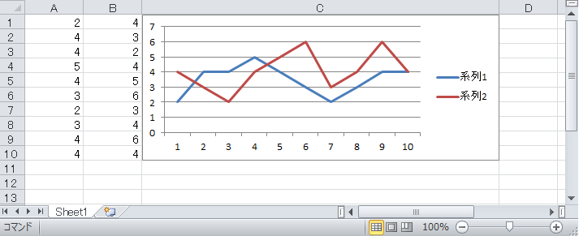

# umya-spreadsheet
[](https://crates.io/crates/umya-spreadsheet)
[](https://github.com/MathNya/umya-spreadsheet#license)

## Description
**umya-spreadsheet** is a library written in pure Rust and read and write xlsx file.

## Support Status
| Function | Remarks |
| --- | --- |
| file | read, lazy_read, write |
| cell value | read, edit, formated value. |
| cell style | read, edit |
| columns | read, edit, auto width |
| charts | detail to # Supported chart types |
| drawings | read, edit(Still might be inconvenient.) |
| images | read, edit(Still might be inconvenient.) |
| ole objects | read, edit(Still might be inconvenient.) |

## Example
example is [**here**](https://docs.rs/umya-spreadsheet/latest/umya_spreadsheet/).

## Supported chart types
* AreaChart
* Area3DChart
* BarChart
* Bar3DChart
* BubbleChart
* DoughnutChart
* LineChart
* Line3DChart
* OfPieChart
* PieChart
* RadarChart
* ScatterChart

Other types will be supported sequentially.

## Add Chart

```rust
extern crate umya_spreadsheet;

let mut book = umya_spreadsheet::new_file();

// add chart
let mut from_marker = umya_spreadsheet::structs::drawing::spreadsheet::MarkerType::default();
let mut to_marker = umya_spreadsheet::structs::drawing::spreadsheet::MarkerType::default();
from_marker.set_coordinate("C1");
to_marker.set_coordinate("D11");
let area_chart_series_list = vec![
    "Sheet1!$A$1:$A$10",
    "Sheet1!$B$1:$B$10",
];
let mut chart = umya_spreadsheet::structs::Chart::default();
chart.new_chart(
    umya_spreadsheet::structs::ChartType::LineChart,
    from_marker,
    to_marker,
    area_chart_series_list,
);
book.get_sheet_by_name_mut("Sheet1").unwrap().get_worksheet_drawing_mut().add_chart_collection(chart);
```
## License
MIT
