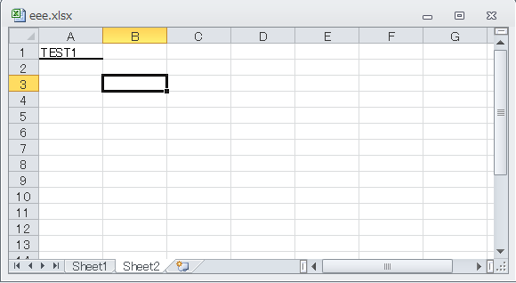
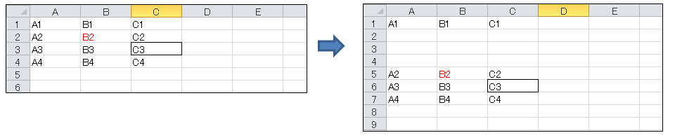

# umya-spreadsheet
[](https://crates.io/crates/umya-spreadsheet)
[](https://github.com/MathNya/umya-spreadsheet#license)

## Description
**umya-spreadsheet** is a library written in pure Rust and read and write xlsx file.

## Supported graph types
* AreaChart
* Area3DChart
* BarChart
* Bar3DChart
* BubbleChart
* DoughnutChart
* LineChart
* Line3DChart
* OfPieChart
* PieChart
* RadarChart
* ScatterChart

Other types will be supported sequentially.

## Example

### Reader or New File
```rust
extern crate umya_spreadsheet;

// reader
let path = std::path::Path::new("C:/spread_test_data/aaa.xlsx");
let mut book = umya_spreadsheet::reader::xlsx::read(path).unwrap();
// or
// new file
let mut book = umya_spreadsheet::new_file();
```
### New worksheet
```rust
extern crate umya_spreadsheet;

let mut book = umya_spreadsheet::new_file();

// new worksheet
let _ = book.new_sheet("Sheet2");
```
### Change value
```rust
extern crate umya_spreadsheet;

let mut book = umya_spreadsheet::new_file();
let _ = book.new_sheet("Sheet2");

// change value
let _ = book.get_sheet_by_name_mut("Sheet2").unwrap().get_cell_mut("A1").set_value("TEST1");
// or
let _ = book.get_sheet_mut(1).get_cell_by_column_and_row_mut(1, 1).set_value("TEST1");
```
### Read value
```rust
extern crate umya_spreadsheet;

let mut book = umya_spreadsheet::new_file();
let _ = book.new_sheet("Sheet2");

// read value
let a1_value = book.get_sheet_by_name("Sheet2").unwrap().get_value("A1");
// or
let a1_value = book.get_sheet(1).unwrap().get_value_by_column_and_row(1, 1);
// or formatted value
let a1_value = book.get_sheet(0).unwrap().get_formatted_value("A1");
assert_eq!("TEST1", a1_value);  // TEST1
```
### Change style
```rust
extern crate umya_spreadsheet;

let mut book = umya_spreadsheet::new_file();
let _ = book.new_sheet("Sheet2");

// add bottom border
let _ = book.get_sheet_by_name_mut("Sheet2").unwrap()
.get_style_mut("A1")
.get_borders_mut()
.get_bottom_mut()
.set_border_style(umya_spreadsheet::Border::BORDER_MEDIUM);
// or
let _ = book.get_sheet_by_name_mut("Sheet2").unwrap()
.get_style_by_column_and_row_mut(1, 1)
.get_borders_mut()
.get_bottom_mut()
.set_border_style(umya_spreadsheet::Border::BORDER_MEDIUM);
```
### Insert or Remove Rows(or Columns)

```rust
extern crate umya_spreadsheet;

let mut book = umya_spreadsheet::new_file();

// insert rows
book.insert_new_row("Sheet1", 2, 3);

// insert columns
book.insert_new_colmun("Sheet1", "B", 3);
// or
book.insert_new_colmun_by_index("Sheet1", 2, 3);

// remove rows
book.remove_row("Sheet1", 6, 2);

// remove columns
book.remove_colmun("Sheet1", "F", 2);
// or
book.remove_colmun_by_index("Sheet1", 6, 2);
```
### Writer
```rust
extern crate umya_spreadsheet;

let mut book = umya_spreadsheet::new_file();
let _ = book.new_sheet("Sheet2");

// writer
let path = std::path::Path::new("C:/spread_test_data/bbb.xlsx");
let _ = umya_spreadsheet::writer::xlsx::write(&book, path);
```
## License
MIT
